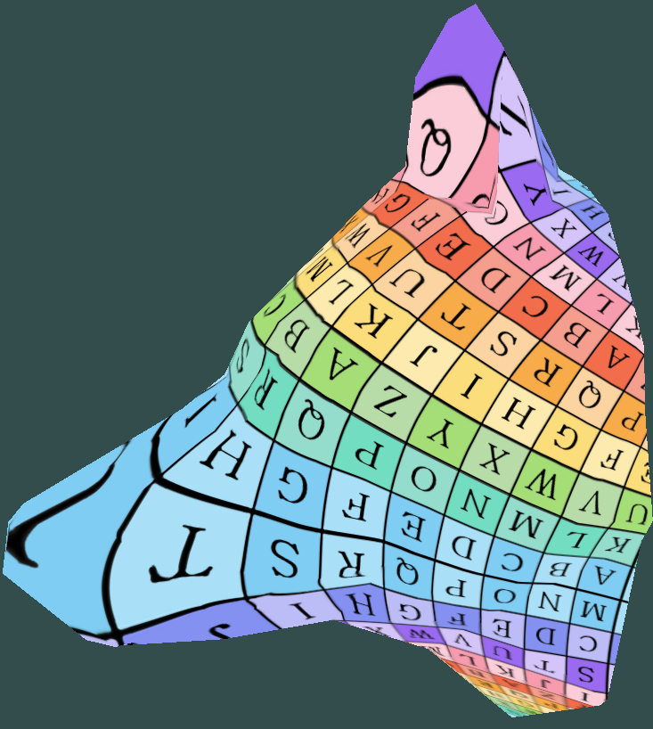

# BPM: Blended Piecewise Möbius Maps
C++ implementation of [BPM: Blended Piecewise M&ouml;bius Maps](https://arxiv.org/pdf/2306.12792.pdf) by Rorberg, Vaxman & Ben-Chen.

|||
|:----:|:-----:|
|BPM interpolation|Piecewise-linear interpolation|

Technical report is under `doc` folder.
## Video
https://github.com/user-attachments/assets/a52ac7f2-1d0c-4e42-91b3-f02ae34ca4d5


## Build Instructions

1. Run the following commands:

    ```bash
    mkdir build
    cd build
    cmake .. -DCMAKE_BUILD_TYPE=Release
    make -j7
    ```

2. After building, make sure model.obj is placed in resources/objects dir, and run the code with:
```
./BPM model.obj
```

Running:
```
./BPM 
```
runs default model.
