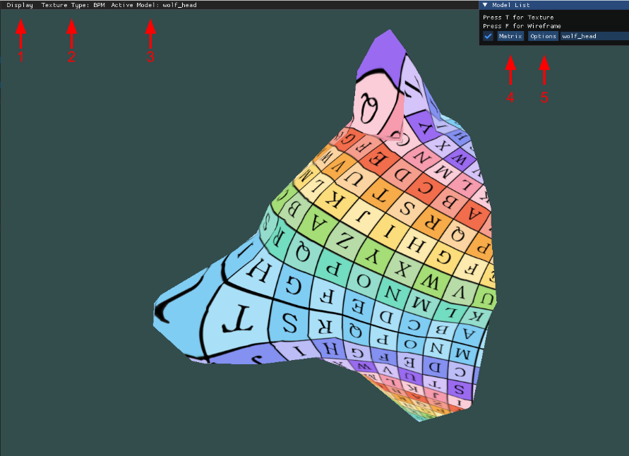

# User Guide
1. Clone the github repo:
```bash
git clone https://github.com/ehud-gordon/BlendedPiecewiseMoebiusMaps.git 
```
2. change directory  to the repository
```bash
cd BlendedPiecewiseMoebiusMaps
```
3. Build the project using CMake: 
```bash
    mkdir build
    cd build
    cmake .. -DCMAKE_BUILD_TYPE=Release
    make -j7
```
4. After build, make sure <model_name>.obj is placed in resources/objects dir, and from inside the build directory, run the code with:
```
./BPM <model_name>.obj
```


Running:
```
./BPM 
```
runs the default model.
## GUI
* Press T to change Texture type from Blended-Piecewise Mobius (BPM) to Linear-Piecewise. The type of texture is shown in (2)
* Press F toggles wireframe
* Press on (1) to change display options: Depth Testing, Vertex Normals (if provided), Face Normals, Backface Culling and Axes.
* Currently displayed model is shown under (3)
* Set Model Matrix under (4)
* Set Rendering Mode: Fill / Wireframe /Bounding Box - under (5).

